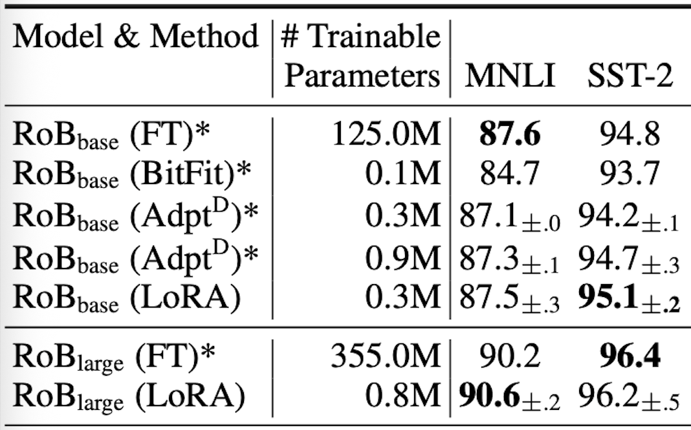
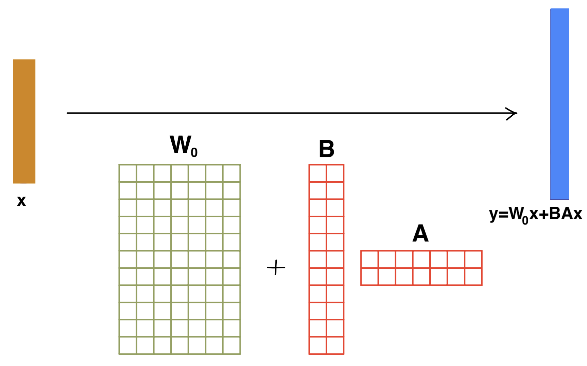

# Re-implementing LoRA: Low-Rank Adaptation of Large Language Models

## INTRODUCTION
---

The goal of this project is to re-implemented results from the paper *LoRA: Low-Rank Adaptation of Large Language Models* by Edward Hu, Yelong Shen, Phillip Wallis, Zeyuan Allen-Zhu, Yuanzhi Li, Shean Wang, Lu Wang, and Weizhu Chen. 

Natural Language Processing utilizes adapting pretrained LLMs to multiple tasks by fine-tuning. Models these days are incredibly large, so full fine-tuning is infeasible because it updates ALL the parameters. The paper's key insight is that the weight updates needed for task adaptation have low intrinsic rank, so  you can freeze the pretrained weight matrix  and inject  two trainable small low-rank matrices, drastically reducing the number of trainable parameters while maintaining high accuracy.

## CHOSEN RESULT
---

The objective is to reproduce their accuracy of 96.2 \pm 0.5 on the SST-2 dataset when applying LoRA (0.8M trainable parameters) to RoBERTa-Large, as reported in Table 2 of (Hu et al., 2022). This is within 0.5 of the accuracy of the full fine-tuned model (355M trainable parameters), showing LoRA achieves full accuracy with far fewer (about 0.2%) trainable parameters. This result demonstrates LoRA's effectiveness clearly.


Table 1. Reference results from (Hu et al., 2022) showing accuracy on SST-2.

## GitHub CONTENTS
---

* README.md
* code/
* data/
* results/
* poster/: contains a pdf poster used for an in-class presentation in Cornell CS4782 (Spring 2026).
* report/: contains a pdf of the final report submitted in Cornell CS4782 (Spring 2026).
* LICENSE

## RE-IMPLEMENTATION DETAILS
---

The LoRA method reduces the number of trainable parameters by freezing the pretrained weight matrix W_0 (size d \times k) and trains only two low-rank matrices A (size r \times k) and B (size d \times r), where r<<min(d,k). The resulting weight update is W_0+BA. In (Hu et al., 2022), the low-rank is r=8.




We fine-tune RoBERTa-Large on the SST-2 sentiment classification task from the GLUE benchmark. Dataset via HuggingFace.
LoRA adapters are injected into query and key matrices, in each layer. Trained for 6 epochs, lr=1*e^-4, AdamW, cosine schedule. Gradient clipping is applied at norm 1.0. Code uses PyTorch methods. Evaluation uses classification accuracy on the SST-2 validation set.

Also implements a modification of LoRA with an additional square matrix C between A and B for extra low-rank computation at very low parameter cost. Update is W_0+ BCA.


## REPRODUCTION STEPS
---

```bash
pip install torch transformers datasets tqdm accelerate
git clone https://github.com/j2399/LoRA-reimp.git
```

Open `code/LoRA.ipynb` in Google Colab (GPU recommended, ~16GB VRAM), run all cells, then:

```python
set_seed(42)
run_all_experiments(data_used=0.5)  # set 1.0 for full dataset
```


## RESULTS / INSIGHTS
---

Top validation accuracy achieved is 96.56% on SST-2 using low-rank r=4. Also achieved 96.1% accuracy with r=8. Both of these are within the 0.5 error range of the original paper's (Hu et al., 2022) accuracy, which is 96.2_{\pm .5}% for  r=8 (see Table 1).

Results:

| Model | Rank r| Trainable Params | Val Accuracy |
|---|---|---|---|
| LoRA re-implemnted | 4 | 395,266 (0.111%) | 95.64% |
| LoRA  re-implemnted | 8 | 788,482 (0.222%) | 95.87% |
| LoRA with an additional third matrix | 4 | 396,034 (0.111%) | 95.41% |
| LoRA with an additional third matrix | 8 | 791,554 (0.222%) | 95.87% |


## CONCLUSION
---

LoRA adapters drastically reduce the number of trainable parameters, while maintaining high accuracy, allowing the model to be fine-tuned with much lower storage and compute costs.


## REFERENCES
---

- Hu, E.J. et al. *LoRA.* ICLR 2022. [arXiv:2106.09685](https://arxiv.org/abs/2106.09685)
- Liu, Y. et al. *RoBERTa.* arXiv:1907.11692, 2019.
- Loshchilov, I. al. *Decoupled Weight Decay Regularization.* ICLR, 2019.
- Paszke, A. et al. *PyTorch.* NeurIPS 2019.
- Socher, R. et al. *Recursive Deep Models for Semantic Compositionality Over a Sentiment Treebank*
- Wang, A. et al. *GLUE: A Multi-Task Benchmark and Analysis Platform for Natural Language Understanding.*
- Wolf, T. et al. *HuggingFace Transformers.* EMNLP 2020.


## ACKNOWLEDGEMENTS
---

Completed as part of coursework for CS4782 (Spring 2026) at Cornell University. Dataset via [HuggingFace](https://huggingface.co/datasets/nyu-mll/glue), base model [RoBERTa-large](https://huggingface.co/roberta-large).
